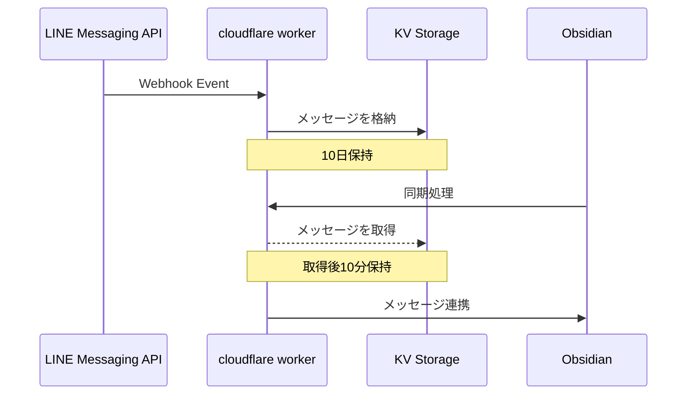

# line-obsidian-worker
lineの投稿をobsidianで読み込めるようにする君

## システム

## その他システム

- **LINE Messaging API**: LINEから設定しwebhookをcloudflare workerのurlで登録
- **Obsidian**: [plugin](https://github.com/ujiuji1259/obsidian-line-plugin)をobsidianに登録
